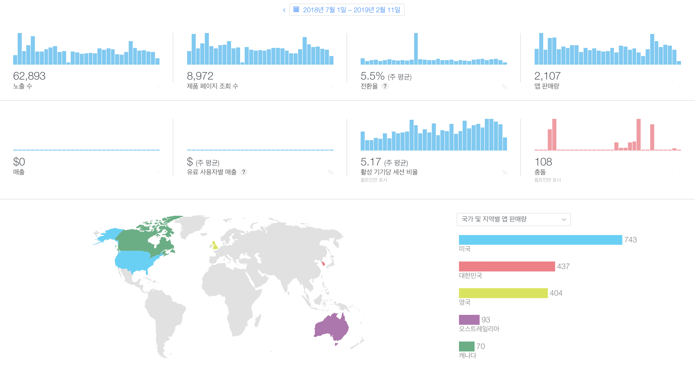

# Week-it 

   
 
 
     

 

> -. 첫번째 개인 앱 프로젝트  
> -. 주간 단위로 일상을 기록하는 어플 Week-it 입니다.

 

## Contents
- [Week-it ](#week-it-img-src--%22httpsgithubcomsungeundeveatitblobmasterscrennshoticonpngrawtrue%22-width--50-align--right)
  - [Contents](#contents)
  - [About Week-it](#about-week-it)
  - [App Analysis](#app-analysis)
  - [Version Update](#version-update)
        - [**update history**](#update-history)
  - [What I Learned](#what-i-learned)
  - [Things to do next](#things-to-do-next)
  - [Contact](#contact)

 

## About Week-it

 

- 2018년 1월에 Swift를 처음 접한 6개월차 초보 개발자의 첫번째 프로젝트입니다.
- Week-it은 **습관 개선**을 목적으로 만든 주간 캘린더 앱입니다. 한 주간의 자신의 생활을 파악하고 통계 화면을 통해 월 단위로, 메인 화면을 통해 요일, 시간단위로 파악할 수 있습니다. 
- 프로젝트 시작부터 출시까지를 모두 경험하는 것을 목표로 개발뿐만 아니라 기획, 디자인 모두 직접 진행하였습니다.

 

>   - Post it! Week it!  
    이번주 당신의 일상은 어떠셨나요?  
    Week-it은 한 주를 의미있게 보냈는지 한 눈에 알 수 있는 주간 기록 어플입니다.  
>    
>   - Rating
    아침, 점심, 저녁 마다 간단하게 일상 생활을 메모하고, 별점을 매겨 보세요.  
    할일을 기록하는 to-do 리스트나 식단 기록장으로 활용해도 좋아요.  
    하나 하나 기록이 쌓여 의미있는 한 주를 만들어 줄 거에요 :)  
>
>    - Analysis   
    나는 어느 요일에, 어느 시간에 가장 중요하고 의미있는 일을 하고 있을까요?  
    통계를 통해 여러분도 몰랐던 생활 패턴을 발견해 보세요.  
    식단을 기록하고 있다면 금요일마다 별 1개짜리 음식을 먹는 당신을 발견할지도 몰라요!  
>
>    -  Colorful Theme  
    다양한 테마를 통해 Week-it에 컬러를 더해보세요.  
    혹시 모든 테마들이 마음에 들지 않는다면, 메일을 통해 테마 색상을 보내주세요!
>
>    - [Youtube Link](https://www.youtube.com/watch?v=l0sixcSdIpw&feature=youtu.be)

 

## App Analysis

- Week-it은 2018년 7월에 release되어 약 7개월 간 6만건의 노출 수, 2,000건의 판매량을 기록하였습니다.
- 한눈에 보이는 단순한 디자인 덕에 🇺🇸 미국, 🇬🇧 영국 등 해외에서 더욱 인기가 있습니다.
- 📫 현재(19.02.14)까지 총 16명이 더 나은 Week-it을 위해 피드백 메일을 보내주셨습니다.

## Version Update
- Week-it은 유저들의 피드백을 받아 조금은 느리지만 지속적으로 업데이트 되고 있습니다 :)
- latest update: ver 1.5.0 (19.02.11)
  
##### **update history**
> - ver 1.5.1: 포스트 고정기능 추가. 다음주 포스트를 입력하지 않아도 자동으로 추가됨 (19.02.11)
> - ver 1.4.0: Christmas for Week-it! 크리스마스 맞이 앱 아이콘 수정 및 테마 추가 (18.12.13)
> - ver 1.3.1: iOS 10.0 지원. 요일별로 날짜 추가되도록 UI 수정 (18.12.09)
> - ver 1.2.0: 주말 on/off 기능 추가. 날짜 형식 변경 가능. 8월 포스트 입력시 앱 종료되는 버그 수정 (18.07.31)
> - ver 1.1.0: KR App Store realease. Localized KR (18.07.08)
> - ver 1.0.0: US App Store release (18.07.04)
> - start: 2018.06.05 ~   

 

## What I Learned
- Tech  
    - Realm: 데이터 베이스로 활용  
    - Today Extension: Widget 연동   
    - Date, Calendar 다루기  
    - Frame based UI
    - Custom Delegate 활용

- Etc.  
    - 개발 전 설계에 대한 필요성  
    - 좋은 코드, 잘 만든 코드란?  
  
 

## Things to do next 
- 🚨 REFACTORING!
  - MVC의 한계를 온 몸으로 체감하는 중입니다. 😫
  - MVVM 패턴 적용을 통해 모델, 뷰를 분리해서 앱 구조를 한 눈에 파악할 수 있도록 리팩토링 합시다!
- 통계 화면 기능 강화
  - 차트를 통해 한 눈에 요일별, 시간별로 무엇을 기록해왔는지 잘 보일 수 있도록 통계화면 UI 수정
- Custom Setting
  - 현재는 한 주의 시작 요일(현재는 월요일)을 설정할 수 있도록 수정

 

## Contact
- phone: +82 10.5835.0602
- mail: p.ssungnni@gmail.com
